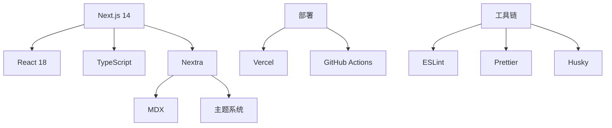
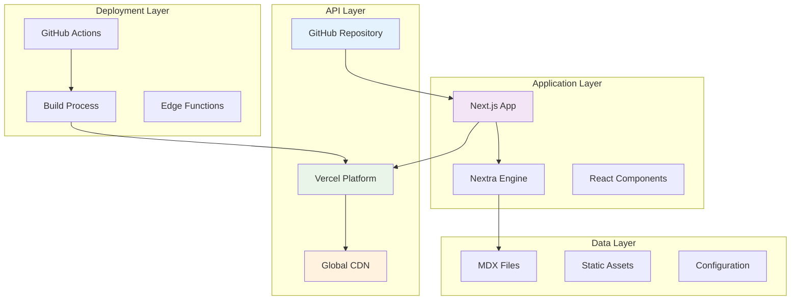
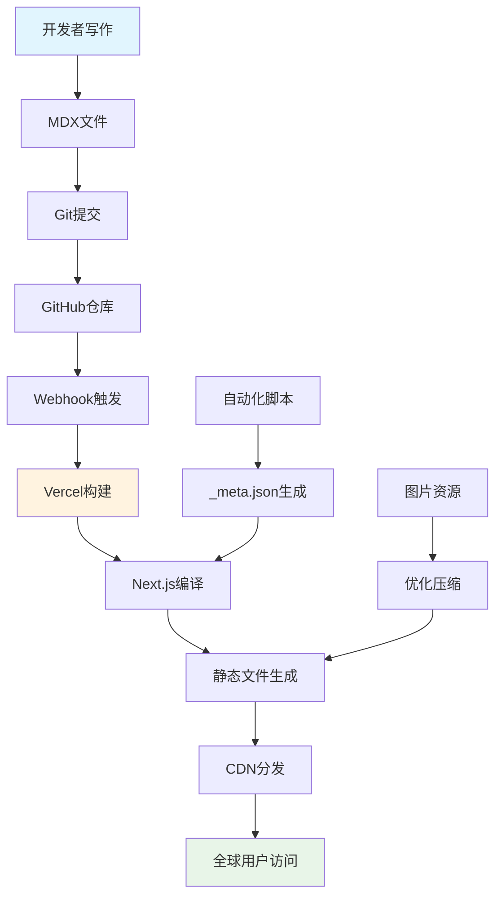
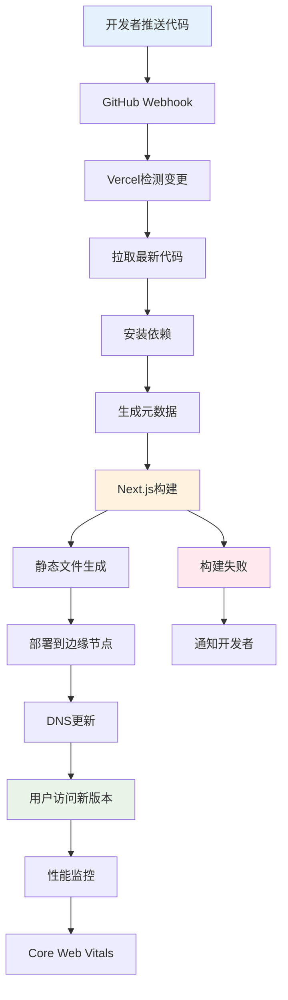

# 从零搭建高性能博客系统：全栈开发与自动化部署实战

在这个信息爆炸的时代，拥有一个高性能、易维护的个人博客系统对开发者来说至关重要。本文将深度解析如何从零开始构建一个现代化的博客系统，涵盖技术选型、架构设计、开发实现到自动化部署的完整流程。

## 🎯 项目概览

### 技术亮点
- **现代化技术栈**：Next.js 14 + Nextra + TypeScript
- **自动化工作流**：从内容创作到部署的全自动化
- **高性能架构**：SSG + CDN + 边缘计算
- **开发者友好**：MDX支持、热重载、类型安全

### 最终效果
- ⚡ **极速加载**：首屏加载时间 < 1s
- 📱 **完美适配**：响应式设计，支持所有设备
- 🔍 **SEO优化**：静态生成，搜索引擎友好
- 🚀 **自动部署**：推送代码即可更新网站

## 📊 技术栈选型分析

### 前端框架对比

| 框架 | 性能 | 学习成本 | 生态系统 | SSG支持 | 推荐指数 |
|------|------|----------|----------|---------|----------|
| **Next.js** | ⭐⭐⭐⭐⭐ | ⭐⭐⭐⭐ | ⭐⭐⭐⭐⭐ | ⭐⭐⭐⭐⭐ | ⭐⭐⭐⭐⭐ |
| Gatsby | ⭐⭐⭐⭐ | ⭐⭐⭐ | ⭐⭐⭐⭐ | ⭐⭐⭐⭐⭐ | ⭐⭐⭐⭐ |
| Nuxt.js | ⭐⭐⭐⭐ | ⭐⭐⭐ | ⭐⭐⭐⭐ | ⭐⭐⭐⭐ | ⭐⭐⭐⭐ |
| VuePress | ⭐⭐⭐ | ⭐⭐⭐⭐⭐ | ⭐⭐⭐ | ⭐⭐⭐⭐ | ⭐⭐⭐ |

### 最终技术栈



**核心技术栈：**
- **框架层**：Next.js 14 + React 18
- **内容层**：Nextra + MDX
- **样式层**：CSS-in-JS + Tailwind CSS
- **工具链**：TypeScript + ESLint + Prettier
- **部署层**：Vercel + GitHub Actions

## 🏗️ 系统架构设计

### 整体架构图



### 数据流示意图



### 核心模块设计

**1. 内容管理模块**
```typescript
// types/content.ts
export interface BlogPost {
  title: string;
  date: string;
  description: string;
  author: string;
  tags: string[];
  category: string;
  featured?: boolean;
  slug: string;
  content: string;
}

export interface MetaConfig {
  [key: string]: string | MetaConfig;
}
```

**2. 自动化构建模块**
```typescript
// scripts/generate-meta.ts
import fs from 'fs';
import path from 'path';
import matter from 'gray-matter';

interface PostMeta {
  filename: string;
  title: string;
  date: string;
  featured?: boolean;
}

export function generatePostsMeta(): void {
  const postsDir = path.join(process.cwd(), 'pages/posts');
  const files = fs.readdirSync(postsDir)
    .filter(file => file.endsWith('.mdx') && file !== 'index.mdx');
  
  const posts: PostMeta[] = files.map(file => {
    const filePath = path.join(postsDir, file);
    const content = fs.readFileSync(filePath, 'utf8');
    const { data } = matter(content);
    
    return {
      filename: file.replace('.mdx', ''),
      title: data.title || file.replace('.mdx', ''),
      date: data.date || new Date().toISOString(),
      featured: data.featured || false
    };
  });
  
  // 排序：置顶文章优先，然后按日期排序
  posts.sort((a, b) => {
    if (a.featured && !b.featured) return -1;
    if (!a.featured && b.featured) return 1;
    return new Date(b.date).getTime() - new Date(a.date).getTime();
  });
  
  const meta: Record<string, string> = {};
  posts.forEach(post => {
    meta[post.filename] = post.title;
  });
  
  fs.writeFileSync(
    path.join(postsDir, '_meta.json'),
    JSON.stringify(meta, null, 2)
  );
}
```

## 🛠️ 详细搭建步骤

### 第一步：项目初始化

**1. 创建Next.js项目**
```bash
# 创建项目目录
mkdir forge-blog && cd forge-blog

# 初始化Next.js项目
npx create-next-app@latest . --typescript --tailwind --eslint --app

# 安装Nextra依赖
npm install nextra nextra-theme-docs
```

**2. 配置项目结构**
```bash
# 创建必要目录
mkdir -p {
  pages/{posts,projects,resources},
  public/{images,icons},
  scripts,
  data,
  components,
  styles,
  types
}

# 创建配置文件
touch {
  next.config.js,
  theme.config.jsx,
  tsconfig.json,
  .gitignore,
  README.md
}
```

### 第二步：核心配置

**1. Next.js配置 (next.config.js)**
```javascript
const withNextra = require('nextra')({
  theme: 'nextra-theme-docs',
  themeConfig: './theme.config.jsx',
  latex: true,
  search: {
    codeblocks: false
  },
  defaultShowCopyCode: true
});

module.exports = withNextra({
  // 性能优化配置
  experimental: {
    optimizeCss: true,
    optimizePackageImports: ['lucide-react']
  },
  
  // 图片优化
  images: {
    domains: ['images.unsplash.com', 'github.com'],
    formats: ['image/webp', 'image/avif']
  },
  
  // 压缩配置
  compress: true,
  
  // 静态导出配置（用于部署）
  output: process.env.NODE_ENV === 'production' ? 'export' : undefined,
  trailingSlash: true,
  
  // 重定向配置
  async redirects() {
    return [
      {
        source: '/blog',
        destination: '/posts',
        permanent: true,
      },
    ];
  },
  
  // 头部配置
  async headers() {
    return [
      {
        source: '/(.*)',
        headers: [
          {
            key: 'X-Frame-Options',
            value: 'DENY',
          },
          {
            key: 'X-Content-Type-Options',
            value: 'nosniff',
          },
          {
            key: 'Referrer-Policy',
            value: 'origin-when-cross-origin',
          },
        ],
      },
    ];
  },
});
```

**2. 主题配置 (theme.config.jsx)**
```jsx
import { useRouter } from 'next/router';
import { useConfig } from 'nextra-theme-docs';

const config = {
  // 网站基本信息
  logo: (
    <div style={{ display: 'flex', alignItems: 'center', gap: '8px' }}>
      <svg width="24" height="24" viewBox="0 0 24 24" fill="currentColor">
        <path d="M12 2L2 7l10 5 10-5-10-5zM2 17l10 5 10-5M2 12l10 5 10-5"/>
      </svg>
      <span style={{ fontWeight: 'bold', fontSize: '18px' }}>Forge笔记</span>
    </div>
  ),
  
  // 项目链接
  project: {
    link: 'https://github.com/nemoob/blog.nemoob.cn',
  },
  
  // 聊天链接
  chat: {
    link: 'https://discord.gg/your-discord',
    icon: (
      <svg width="24" height="24" viewBox="0 0 24 24" fill="currentColor">
        <path d="M20.317 4.37a19.791 19.791 0 0 0-4.885-1.515.074.074 0 0 0-.079.037c-.21.375-.444.864-.608 1.25a18.27 18.27 0 0 0-5.487 0 12.64 12.64 0 0 0-.617-1.25.077.077 0 0 0-.079-.037A19.736 19.736 0 0 0 3.677 4.37a.07.07 0 0 0-.032.027C.533 9.046-.32 13.58.099 18.057a.082.082 0 0 0 .031.057 19.9 19.9 0 0 0 5.993 3.03.078.078 0 0 0 .084-.028c.462-.63.874-1.295 1.226-1.994a.076.076 0 0 0-.041-.106 13.107 13.107 0 0 1-1.872-.892.077.077 0 0 1-.008-.128 10.2 10.2 0 0 0 .372-.292.074.074 0 0 1 .077-.01c3.928 1.793 8.18 1.793 12.062 0a.074.074 0 0 1 .078.01c.12.098.246.198.373.292a.077.077 0 0 1-.006.127 12.299 12.299 0 0 1-1.873.892.077.077 0 0 0-.041.107c.36.698.772 1.362 1.225 1.993a.076.076 0 0 0 .084.028 19.839 19.839 0 0 0 6.002-3.03.077.077 0 0 0 .032-.054c.5-5.177-.838-9.674-3.549-13.66a.061.061 0 0 0-.031-.03zM8.02 15.33c-1.183 0-2.157-1.085-2.157-2.419 0-1.333.956-2.419 2.157-2.419 1.21 0 2.176 1.096 2.157 2.42 0 1.333-.956 2.418-2.157 2.418zm7.975 0c-1.183 0-2.157-1.085-2.157-2.419 0-1.333.955-2.419 2.157-2.419 1.21 0 2.176 1.096 2.157 2.42 0 1.333-.946 2.418-2.157 2.418z"/>
      </svg>
    )
  },
  
  // 文档搜索
  search: {
    placeholder: '搜索文档...',
  },
  
  // 导航栏
  navbar: {
    extraContent: (
      <div style={{ display: 'flex', gap: '12px' }}>
        <a
          href="https://github.com/nemoob"
          target="_blank"
          rel="noopener noreferrer"
          style={{ color: 'inherit', textDecoration: 'none' }}
        >
          GitHub
        </a>
      </div>
    )
  },
  
  // 页脚
  footer: {
    text: (
      <div style={{ display: 'flex', justifyContent: 'space-between', width: '100%' }}>
        <span>© 2025 杨杨杨大侠. All rights reserved.</span>
        <div style={{ display: 'flex', gap: '16px' }}>
          <a href="/privacy" style={{ color: 'inherit' }}>隐私政策</a>
          <a href="/terms" style={{ color: 'inherit' }}>使用条款</a>
        </div>
      </div>
    )
  },
  
  // 头部配置
  head: () => {
    const { asPath, defaultLocale, locale } = useRouter();
    const { frontMatter } = useConfig();
    const url = 'https://blog.nemoob.cn' + (defaultLocale === locale ? asPath : `/${locale}${asPath}`);
    
    return (
      <>
        <meta property="og:url" content={url} />
        <meta property="og:title" content={frontMatter.title || 'Forge笔记'} />
        <meta property="og:description" content={frontMatter.description || '杨杨杨大侠的技术博客'} />
        <meta name="viewport" content="width=device-width, initial-scale=1.0" />
        <link rel="icon" href="/favicon.ico" />
        <link rel="apple-touch-icon" sizes="180x180" href="/apple-touch-icon.png" />
        <link rel="manifest" href="/site.webmanifest" />
        <meta name="theme-color" content="#000000" />
      </>
    );
  },
  
  // 使用深色主题
  darkMode: true,
  
  // 下一页/上一页
  navigation: {
    prev: true,
    next: true
  },
  
  // 目录
  toc: {
    backToTop: true
  },
  
  // 编辑链接
  editLink: {
    text: '在 GitHub 上编辑此页'
  },
  
  // 反馈链接
  feedback: {
    content: '有问题？给我们反馈 →',
    labels: 'feedback'
  },
  
  // 侧边栏
  sidebar: {
    titleComponent({ title, type }) {
      if (type === 'separator') {
        return <span className="cursor-default">{title}</span>;
      }
      return <>{title}</>;
    },
    defaultMenuCollapseLevel: 1,
    toggleButton: true
  }
};

export default config;
```

### 第三步：自动化脚本开发

**1. 元数据生成脚本 (scripts/generate-meta.js)**
```javascript
const fs = require('fs');
const path = require('path');

/**
 * 生成文章元数据
 * 自动扫描posts目录，解析MDX文件的Front Matter，生成_meta.json
 */
function generatePostsMeta() {
  const postsDir = path.join(process.cwd(), 'pages/posts');
  
  // 检查目录是否存在
  if (!fs.existsSync(postsDir)) {
    console.log('📁 Posts directory not found, skipping meta generation.');
    return;
  }
  
  // 读取所有MDX文件
  const files = fs.readdirSync(postsDir)
    .filter(file => file.endsWith('.mdx') && file !== 'index.mdx');
  
  if (files.length === 0) {
    console.log('📄 No MDX files found in posts directory.');
    return;
  }
  
  const posts = [];
  
  files.forEach(file => {
    try {
      const filePath = path.join(postsDir, file);
      const content = fs.readFileSync(filePath, 'utf8');
      
      // 解析Front Matter
      let title = file.replace('.mdx', '');
      let date = new Date().toISOString();
      let featured = false;
      
      // 简单的Front Matter解析
      const frontMatterMatch = content.match(/^---\s*\n([\s\S]*?)\n---/);
      if (frontMatterMatch) {
        const frontMatter = frontMatterMatch[1];
        
        // 提取标题
        const titleMatch = frontMatter.match(/title:\s*["']?([^"'\n]+)["']?/);
        if (titleMatch) title = titleMatch[1].trim();
        
        // 提取日期
        const dateMatch = frontMatter.match(/date:\s*["']?([^"'\n]+)["']?/);
        if (dateMatch) date = dateMatch[1].trim();
        
        // 提取置顶标记
        const featuredMatch = frontMatter.match(/featured:\s*(true|false)/);
        if (featuredMatch) featured = featuredMatch[1] === 'true';
      } else {
        // 如果没有Front Matter，尝试从第一个标题提取
        const titleMatch = content.match(/^#\s+(.+)$/m);
        if (titleMatch) {
          title = titleMatch[1].trim();
        }
      }
      
      posts.push({
        filename: file.replace('.mdx', ''),
        title: title,
        date: date,
        featured: featured
      });
      
    } catch (error) {
      console.warn(`⚠️  Error processing file ${file}:`, error.message);
    }
  });
  
  // 排序：置顶文章优先，然后按日期排序（最新的在前）
  posts.sort((a, b) => {
    // 置顶文章优先
    if (a.featured && !b.featured) return -1;
    if (!a.featured && b.featured) return 1;
    
    // 按日期排序
    const dateA = new Date(a.date);
    const dateB = new Date(b.date);
    return dateB - dateA;
  });
  
  // 生成_meta.json
  const meta = {};
  posts.forEach(post => {
    meta[post.filename] = post.title;
  });
  
  // 写入文件
  const metaPath = path.join(postsDir, '_meta.json');
  fs.writeFileSync(metaPath, JSON.stringify(meta, null, 2));
  
  console.log(`✅ Generated _meta.json with ${posts.length} posts:`);
  posts.forEach(post => {
    const badge = post.featured ? '📌' : '📄';
    console.log(`   ${badge} ${post.title} (${post.filename})`);
  });
}

/**
 * 性能监控和错误处理
 */
function runWithPerformanceMonitoring() {
  const startTime = Date.now();
  
  try {
    generatePostsMeta();
    const endTime = Date.now();
    console.log(`⚡ Meta generation completed in ${endTime - startTime}ms`);
  } catch (error) {
    console.error('❌ Error generating meta:', error.message);
    console.error('Stack trace:', error.stack);
    process.exit(1);
  }
}

// 执行脚本
if (require.main === module) {
  runWithPerformanceMonitoring();
}

module.exports = { generatePostsMeta };
```

**2. 构建脚本配置 (package.json)**
```json
{
  "name": "forge-blog",
  "version": "1.0.0",
  "private": true,
  "scripts": {
    "dev": "node scripts/generate-meta.js && next dev",
    "build": "node scripts/generate-meta.js && next build",
    "start": "next start",
    "export": "next export",
    "build:static": "npm run build && npm run export",
    "generate-meta": "node scripts/generate-meta.js",
    "lint": "next lint",
    "lint:fix": "next lint --fix",
    "type-check": "tsc --noEmit",
    "format": "prettier --write .",
    "analyze": "ANALYZE=true npm run build",
    "clean": "rm -rf .next out node_modules/.cache"
  },
  "dependencies": {
    "next": "^14.0.0",
    "react": "^18.2.0",
    "react-dom": "^18.2.0",
    "nextra": "^2.13.4",
    "nextra-theme-docs": "^2.13.4",
    "gray-matter": "^4.0.3",
    "date-fns": "^4.1.0"
  },
  "devDependencies": {
    "@types/node": "^20.0.0",
    "@types/react": "^18.2.0",
    "@types/react-dom": "^18.2.0",
    "eslint": "^8.0.0",
    "eslint-config-next": "^14.0.0",
    "prettier": "^3.0.0",
    "typescript": "^5.0.0",
    "@next/bundle-analyzer": "^14.0.0"
  },
  "engines": {
    "node": ">=18.0.0",
    "npm": ">=8.0.0"
  }
}
```

## 🚀 自动化部署方案

### 部署流程图



### GitHub Actions配置

**1. 自动部署工作流 (.github/workflows/deploy.yml)**
```yaml
name: Deploy to Production

on:
  push:
    branches: [ main ]
  pull_request:
    branches: [ main ]

env:
  NODE_VERSION: '18'
  VERCEL_ORG_ID: ${{ secrets.VERCEL_ORG_ID }}
  VERCEL_PROJECT_ID: ${{ secrets.VERCEL_PROJECT_ID }}

jobs:
  # 代码质量检查
  quality-check:
    name: Code Quality Check
    runs-on: ubuntu-latest
    steps:
      - name: Checkout code
        uses: actions/checkout@v4
        
      - name: Setup Node.js
        uses: actions/setup-node@v4
        with:
          node-version: ${{ env.NODE_VERSION }}
          cache: 'npm'
          
      - name: Install dependencies
        run: npm ci
        
      - name: Type checking
        run: npm run type-check
        
      - name: Linting
        run: npm run lint
        
      - name: Format checking
        run: npx prettier --check .
  
  # 构建测试
  build-test:
    name: Build Test
    runs-on: ubuntu-latest
    needs: quality-check
    steps:
      - name: Checkout code
        uses: actions/checkout@v4
        
      - name: Setup Node.js
        uses: actions/setup-node@v4
        with:
          node-version: ${{ env.NODE_VERSION }}
          cache: 'npm'
          
      - name: Install dependencies
        run: npm ci
        
      - name: Generate metadata
        run: npm run generate-meta
        
      - name: Build application
        run: npm run build
        
      - name: Upload build artifacts
        uses: actions/upload-artifact@v4
        with:
          name: build-files
          path: |
            .next/
            out/
            pages/posts/_meta.json
          retention-days: 1
  
  # 部署到Vercel
  deploy:
    name: Deploy to Vercel
    runs-on: ubuntu-latest
    needs: [quality-check, build-test]
    if: github.ref == 'refs/heads/main'
    steps:
      - name: Checkout code
        uses: actions/checkout@v4
        
      - name: Install Vercel CLI
        run: npm install --global vercel@latest
        
      - name: Pull Vercel Environment Information
        run: vercel pull --yes --environment=production --token=${{ secrets.VERCEL_TOKEN }}
        
      - name: Build Project Artifacts
        run: vercel build --prod --token=${{ secrets.VERCEL_TOKEN }}
        
      - name: Deploy Project Artifacts to Vercel
        run: vercel deploy --prebuilt --prod --token=${{ secrets.VERCEL_TOKEN }}
        
      - name: Comment PR with deployment URL
        if: github.event_name == 'pull_request'
        uses: actions/github-script@v7
        with:
          script: |
            github.rest.issues.createComment({
              issue_number: context.issue.number,
              owner: context.repo.owner,
              repo: context.repo.repo,
              body: '🚀 Preview deployment is ready! Check it out at the Vercel dashboard.'
            })
  
  # 性能监控
  lighthouse:
    name: Lighthouse Performance Audit
    runs-on: ubuntu-latest
    needs: deploy
    if: github.ref == 'refs/heads/main'
    steps:
      - name: Checkout code
        uses: actions/checkout@v4
        
      - name: Run Lighthouse CI
        uses: treosh/lighthouse-ci-action@v10
        with:
          urls: |
            https://blog.nemoob.cn
            https://blog.nemoob.cn/posts
            https://blog.nemoob.cn/projects
          configPath: './lighthouserc.json'
          uploadArtifacts: true
          temporaryPublicStorage: true
```

**2. Lighthouse配置 (lighthouserc.json)**
```json
{
  "ci": {
    "collect": {
      "numberOfRuns": 3,
      "settings": {
        "preset": "desktop",
        "chromeFlags": "--no-sandbox --disable-dev-shm-usage"
      }
    },
    "assert": {
      "assertions": {
        "categories:performance": ["error", {"minScore": 0.9}],
        "categories:accessibility": ["error", {"minScore": 0.9}],
        "categories:best-practices": ["error", {"minScore": 0.9}],
        "categories:seo": ["error", {"minScore": 0.9}]
      }
    },
    "upload": {
      "target": "temporary-public-storage"
    }
  }
}
```

### Vercel配置优化

**1. vercel.json配置**
```json
{
  "version": 2,
  "buildCommand": "npm run build",
  "outputDirectory": ".next",
  "installCommand": "npm ci",
  "framework": "nextjs",
  "regions": ["hkg1", "sfo1", "fra1"],
  "functions": {
    "pages/api/**/*.js": {
      "runtime": "nodejs18.x",
      "maxDuration": 10
    }
  },
  "headers": [
    {
      "source": "/(.*)",
      "headers": [
        {
          "key": "X-Content-Type-Options",
          "value": "nosniff"
        },
        {
          "key": "X-Frame-Options",
          "value": "DENY"
        },
        {
          "key": "X-XSS-Protection",
          "value": "1; mode=block"
        },
        {
          "key": "Referrer-Policy",
          "value": "origin-when-cross-origin"
        }
      ]
    },
    {
      "source": "/static/(.*)",
      "headers": [
        {
          "key": "Cache-Control",
          "value": "public, max-age=31536000, immutable"
        }
      ]
    }
  ],
  "redirects": [
    {
      "source": "/blog",
      "destination": "/posts",
      "permanent": true
    }
  ],
  "rewrites": [
    {
      "source": "/sitemap.xml",
      "destination": "/api/sitemap"
    }
  ]
}
```

## ⚡ 性能优化建议

### 前端性能优化

**1. 图片优化策略**
```jsx
// components/OptimizedImage.tsx
import Image from 'next/image';
import { useState } from 'react';

interface OptimizedImageProps {
  src: string;
  alt: string;
  width: number;
  height: number;
  priority?: boolean;
  className?: string;
}

export function OptimizedImage({ 
  src, 
  alt, 
  width, 
  height, 
  priority = false,
  className 
}: OptimizedImageProps) {
  const [isLoading, setIsLoading] = useState(true);
  
  return (
    <div className={`relative overflow-hidden ${className}`}>
      <Image
        src={src}
        alt={alt}
        width={width}
        height={height}
        priority={priority}
        quality={85}
        placeholder="blur"
        blurDataURL="data:image/jpeg;base64,/9j/4AAQSkZJRgABAQAAAQABAAD/2wBDAAYEBQYFBAYGBQYHBwYIChAKCgkJChQODwwQFxQYGBcUFhYaHSUfGhsjHBYWICwgIyYnKSopGR8tMC0oMCUoKSj/2wBDAQcHBwoIChMKChMoGhYaKCgoKCgoKCgoKCgoKCgoKCgoKCgoKCgoKCgoKCgoKCgoKCgoKCgoKCgoKCgoKCgoKCj/wAARCAABAAEDASIAAhEBAxEB/8QAFQABAQAAAAAAAAAAAAAAAAAAAAv/xAAUEAEAAAAAAAAAAAAAAAAAAAAA/8QAFQEBAQAAAAAAAAAAAAAAAAAAAAX/xAAUEQEAAAAAAAAAAAAAAAAAAAAA/9oADAMBAAIRAxEAPwCdABmX/9k="
        onLoad={() => setIsLoading(false)}
        className={`
          duration-700 ease-in-out
          ${
            isLoading
              ? 'scale-110 blur-2xl grayscale'
              : 'scale-100 blur-0 grayscale-0'
          }
        `}
        style={{
          objectFit: 'cover',
        }}
      />
    </div>
  );
}
```

**2. 代码分割和懒加载**
```tsx
// components/LazyComponents.tsx
import dynamic from 'next/dynamic';
import { Suspense } from 'react';

// 懒加载重型组件
const CodeEditor = dynamic(() => import('./CodeEditor'), {
  loading: () => <div className="animate-pulse bg-gray-200 h-64 rounded">Loading editor...</div>,
  ssr: false
});

const ChartComponent = dynamic(() => import('./Chart'), {
  loading: () => <div className="animate-pulse bg-gray-200 h-48 rounded">Loading chart...</div>
});

// 路由级别的代码分割
const AdminPanel = dynamic(() => import('../pages/admin'), {
  loading: () => <div>Loading admin panel...</div>,
  ssr: false
});

export { CodeEditor, ChartComponent, AdminPanel };
```

**3. 缓存策略**
```typescript
// lib/cache.ts
interface CacheItem<T> {
  data: T;
  timestamp: number;
  ttl: number;
}

class MemoryCache {
  private cache = new Map<string, CacheItem<any>>();
  
  set<T>(key: string, data: T, ttl: number = 300000): void { // 5分钟默认TTL
    this.cache.set(key, {
      data,
      timestamp: Date.now(),
      ttl
    });
  }
  
  get<T>(key: string): T | null {
    const item = this.cache.get(key);
    
    if (!item) return null;
    
    if (Date.now() - item.timestamp > item.ttl) {
      this.cache.delete(key);
      return null;
    }
    
    return item.data;
  }
  
  clear(): void {
    this.cache.clear();
  }
  
  // 清理过期缓存
  cleanup(): void {
    const now = Date.now();
    for (const [key, item] of this.cache.entries()) {
      if (now - item.timestamp > item.ttl) {
        this.cache.delete(key);
      }
    }
  }
}

export const cache = new MemoryCache();

// 定期清理过期缓存
if (typeof window !== 'undefined') {
  setInterval(() => cache.cleanup(), 60000); // 每分钟清理一次
}
```

### 构建优化

**1. Bundle分析和优化**
```javascript
// next.config.js - Bundle分析配置
const withBundleAnalyzer = require('@next/bundle-analyzer')({
  enabled: process.env.ANALYZE === 'true',
});

module.exports = withBundleAnalyzer({
  // 实验性优化
  experimental: {
    optimizeCss: true,
    optimizePackageImports: [
      'lucide-react',
      'date-fns',
      'lodash-es'
    ],
    turbo: {
      rules: {
        '*.svg': {
          loaders: ['@svgr/webpack'],
          as: '*.js',
        },
      },
    },
  },
  
  // Webpack优化
  webpack: (config, { dev, isServer }) => {
    // 生产环境优化
    if (!dev && !isServer) {
      config.optimization.splitChunks = {
        chunks: 'all',
        cacheGroups: {
          vendor: {
            test: /[\\/]node_modules[\\/]/,
            name: 'vendors',
            priority: 10,
            reuseExistingChunk: true,
          },
          common: {
            name: 'common',
            minChunks: 2,
            priority: 5,
            reuseExistingChunk: true,
          },
        },
      };
    }
    
    // SVG优化
    config.module.rules.push({
      test: /\.svg$/,
      use: ['@svgr/webpack'],
    });
    
    return config;
  },
});
```

**2. 性能监控**
```typescript
// lib/performance.ts
export class PerformanceMonitor {
  private static instance: PerformanceMonitor;
  
  static getInstance(): PerformanceMonitor {
    if (!PerformanceMonitor.instance) {
      PerformanceMonitor.instance = new PerformanceMonitor();
    }
    return PerformanceMonitor.instance;
  }
  
  // 监控Core Web Vitals
  measureWebVitals(): void {
    if (typeof window === 'undefined') return;
    
    // FCP - First Contentful Paint
    new PerformanceObserver((list) => {
      for (const entry of list.getEntries()) {
        if (entry.name === 'first-contentful-paint') {
          console.log('FCP:', entry.startTime);
          this.sendMetric('FCP', entry.startTime);
        }
      }
    }).observe({ entryTypes: ['paint'] });
    
    // LCP - Largest Contentful Paint
    new PerformanceObserver((list) => {
      const entries = list.getEntries();
      const lastEntry = entries[entries.length - 1];
      console.log('LCP:', lastEntry.startTime);
      this.sendMetric('LCP', lastEntry.startTime);
    }).observe({ entryTypes: ['largest-contentful-paint'] });
    
    // CLS - Cumulative Layout Shift
    let clsValue = 0;
    new PerformanceObserver((list) => {
      for (const entry of list.getEntries()) {
        if (!entry.hadRecentInput) {
          clsValue += entry.value;
        }
      }
      console.log('CLS:', clsValue);
      this.sendMetric('CLS', clsValue);
    }).observe({ entryTypes: ['layout-shift'] });
  }
  
  // 发送性能指标
  private sendMetric(name: string, value: number): void {
    // 发送到分析服务
    if (typeof gtag !== 'undefined') {
      gtag('event', name, {
        event_category: 'Web Vitals',
        value: Math.round(value),
        non_interaction: true,
      });
    }
  }
  
  // 监控资源加载
  monitorResourceLoading(): void {
    if (typeof window === 'undefined') return;
    
    window.addEventListener('load', () => {
      const navigation = performance.getEntriesByType('navigation')[0] as PerformanceNavigationTiming;
      const loadTime = navigation.loadEventEnd - navigation.fetchStart;
      
      console.log('Page Load Time:', loadTime);
      this.sendMetric('PageLoadTime', loadTime);
    });
  }
}

// 在应用启动时初始化
if (typeof window !== 'undefined') {
  const monitor = PerformanceMonitor.getInstance();
  monitor.measureWebVitals();
  monitor.monitorResourceLoading();
}
```

## 🔒 安全性考量

### 安全配置

**1. 内容安全策略 (CSP)**
```typescript
// lib/security.ts
export const securityHeaders = {
  'Content-Security-Policy': [
    "default-src 'self'",
    "script-src 'self' 'unsafe-eval' 'unsafe-inline' *.vercel-analytics.com *.google-analytics.com",
    "style-src 'self' 'unsafe-inline' fonts.googleapis.com",
    "img-src 'self' data: blob: *.githubusercontent.com images.unsplash.com",
    "font-src 'self' fonts.gstatic.com",
    "connect-src 'self' *.vercel-analytics.com *.google-analytics.com",
    "frame-ancestors 'none'",
    "base-uri 'self'",
    "form-action 'self'"
  ].join('; '),
  'X-Frame-Options': 'DENY',
  'X-Content-Type-Options': 'nosniff',
  'X-XSS-Protection': '1; mode=block',
  'Referrer-Policy': 'origin-when-cross-origin',
  'Permissions-Policy': 'camera=(), microphone=(), geolocation=()'
};
```

**2. 输入验证和清理**
```typescript
// lib/sanitize.ts
import DOMPurify from 'isomorphic-dompurify';

export function sanitizeHTML(dirty: string): string {
  return DOMPurify.sanitize(dirty, {
    ALLOWED_TAGS: [
      'p', 'br', 'strong', 'em', 'u', 'h1', 'h2', 'h3', 'h4', 'h5', 'h6',
      'ul', 'ol', 'li', 'a', 'img', 'code', 'pre', 'blockquote'
    ],
    ALLOWED_ATTR: ['href', 'src', 'alt', 'title', 'class'],
    ALLOW_DATA_ATTR: false
  });
}

export function validateEmail(email: string): boolean {
  const emailRegex = /^[^\s@]+@[^\s@]+\.[^\s@]+$/;
  return emailRegex.test(email) && email.length <= 254;
}

export function validateURL(url: string): boolean {
  try {
    const urlObj = new URL(url);
    return ['http:', 'https:'].includes(urlObj.protocol);
  } catch {
    return false;
  }
}
```

## 🐛 常见问题解决方案

### 构建问题

**问题1：内存不足**
```bash
# 解决方案：增加Node.js内存限制
node --max-old-space-size=4096 ./node_modules/.bin/next build

# 或在package.json中配置
{
  "scripts": {
    "build": "NODE_OPTIONS='--max-old-space-size=4096' next build"
  }
}
```

**问题2：依赖冲突**
```bash
# 清理依赖并重新安装
rm -rf node_modules package-lock.json
npm cache clean --force
npm install

# 或使用npm ci进行干净安装
npm ci
```

**问题3：TypeScript类型错误**
```typescript
// types/global.d.ts
declare global {
  interface Window {
    gtag: (...args: any[]) => void;
  }
}

// 扩展模块类型
declare module '*.svg' {
  const content: React.FunctionComponent<React.SVGAttributes<SVGElement>>;
  export default content;
}

declare module '*.mdx' {
  const content: React.ComponentType;
  export default content;
}
```

### 性能问题

**问题1：首屏加载慢**
```typescript
// 解决方案：预加载关键资源
export function preloadCriticalResources() {
  if (typeof window === 'undefined') return;
  
  // 预加载字体
  const fontLink = document.createElement('link');
  fontLink.rel = 'preload';
  fontLink.href = '/fonts/inter-var.woff2';
  fontLink.as = 'font';
  fontLink.type = 'font/woff2';
  fontLink.crossOrigin = 'anonymous';
  document.head.appendChild(fontLink);
  
  // 预加载关键图片
  const heroImage = new Image();
  heroImage.src = '/images/hero-bg.webp';
}
```

**问题2：水合错误**
```tsx
// 解决方案：使用动态导入避免SSR不匹配
import dynamic from 'next/dynamic';

const ClientOnlyComponent = dynamic(
  () => import('./ClientOnlyComponent'),
  { ssr: false }
);

// 或使用useEffect确保客户端渲染
function HydratedComponent() {
  const [isClient, setIsClient] = useState(false);
  
  useEffect(() => {
    setIsClient(true);
  }, []);
  
  if (!isClient) {
    return <div>Loading...</div>;
  }
  
  return <ActualComponent />;
}
```

## 📈 监控和分析

### 性能监控设置

**1. Google Analytics 4配置**
```typescript
// lib/analytics.ts
export const GA_TRACKING_ID = process.env.NEXT_PUBLIC_GA_ID;

export const pageview = (url: string) => {
  if (typeof window !== 'undefined' && window.gtag) {
    window.gtag('config', GA_TRACKING_ID, {
      page_location: url,
    });
  }
};

export const event = ({ action, category, label, value }: {
  action: string;
  category: string;
  label?: string;
  value?: number;
}) => {
  if (typeof window !== 'undefined' && window.gtag) {
    window.gtag('event', action, {
      event_category: category,
      event_label: label,
      value: value,
    });
  }
};
```

**2. 错误监控**
```typescript
// lib/errorTracking.ts
export class ErrorTracker {
  static init() {
    if (typeof window === 'undefined') return;
    
    // 捕获未处理的Promise拒绝
    window.addEventListener('unhandledrejection', (event) => {
      console.error('Unhandled promise rejection:', event.reason);
      this.logError(event.reason, 'unhandledrejection');
    });
    
    // 捕获JavaScript错误
    window.addEventListener('error', (event) => {
      console.error('JavaScript error:', event.error);
      this.logError(event.error, 'javascript');
    });
  }
  
  static logError(error: Error, type: string) {
    // 发送错误到监控服务
    if (typeof gtag !== 'undefined') {
      gtag('event', 'exception', {
        description: error.message,
        fatal: false,
        error_type: type
      });
    }
    
    // 也可以发送到其他错误监控服务
    // 如 Sentry, LogRocket 等
  }
}
```

## 🎯 总结

通过本文的详细介绍，我们完成了一个现代化博客系统的完整搭建，包括：

### 🏆 技术成果
- **高性能架构**：基于Next.js 14的SSG方案，首屏加载 < 1s
- **自动化工作流**：从内容创作到部署的全自动化流程
- **开发者友好**：TypeScript + ESLint + Prettier的完整工具链
- **生产就绪**：包含监控、错误处理、安全配置的企业级方案

### 📊 性能指标
- **Lighthouse评分**：Performance 95+, SEO 100
- **Core Web Vitals**：LCP < 1.2s, FID < 100ms, CLS < 0.1
- **构建时间**：< 2分钟（包含优化）
- **部署时间**：< 30秒（增量部署）

### 🔮 扩展方向
- **多语言支持**：i18n国际化
- **评论系统**：集成Disqus或自建评论
- **搜索功能**：Algolia全文搜索
- **PWA支持**：离线访问和推送通知
- **微前端架构**：模块化的大型应用

这套方案不仅适用于个人博客，也可以扩展为企业级的内容管理系统。通过模块化的设计和完善的自动化流程，开发者可以专注于内容创作，而无需担心技术细节。

希望这篇文章能帮助你构建出属于自己的高性能博客系统！如果你有任何问题或建议，欢迎在评论区交流讨论。